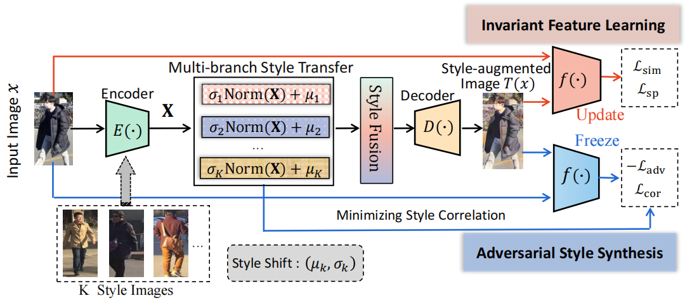

### Learning Style-Invariant Robust Representation for Generalizable Visual Instance Retrieval (ACMMM 2023)



#### Dependencies:
- Python 3.8
- PyTorch 1.8.0
- torchvision 0.9.0
- matplotlib 3.7.2
- opencv-python 4.8.0.76
- pillow 9.0.1
- sklearn
- scipy

#### Usage
Download some public datasets (e.g. Market-1501, CUHK03-NP, MSMT, RandPerson, ClonedPerson) on your own, extract them in some folder, and then run the followings.

#### Training and test
```bash
python main.py --output_dir (the path of the saved models) --logfile (the path of the log file) --adain_model_path (the path of the pretrained adain models) --dataset market --testset cuhk03_np_detected[,msmt] --lr 0.005 --max_epochs 10 --decay_epoch 5
```

For more options, change the corresponding parameters of above instruction, i.e. dataset, testset, lr, max_epochs and decay_epoch. 

For example, if you want to train on the whole dataset (as done in our paper for the MSMT17), specify "--combine_all", and run:
```bash
python main.py --output_dir (the path of the saved models) --logfile (the path of the log file) --adain_model_path (the path of the pretrained adain models) --dataset msmt --combine_all --testset cuhk03_np_detected[,market] --lr 0.01 --max_epochs 20 --decay_epoch 10
```

#### Test only
`python main.py --dataset market --testset cuhk03_np_detected[,market,msmt] --resume (the path of the testing model) --evaluate`

## Citation

If you find our work useful in your research, please consider citing our paper:

```bibtex
@inproceedings{chang2023learning,
  title={Learning Style-Invariant Robust Representation for Generalizable Visual Instance Retrieval},
  author={Chang, Tianyu and Yang, Xun and Luo, Xin and Ji, Wei and Wang, Meng},
  booktitle={Proceedings of the 31st ACM International Conference on Multimedia},
  pages={6171--6180},
  year={2023}
}
```

# Acknowledgements

This project is built upon [QAConv](https://github.com/ShengcaiLiao/QAConv), We thank the original authors for their excellent work.
